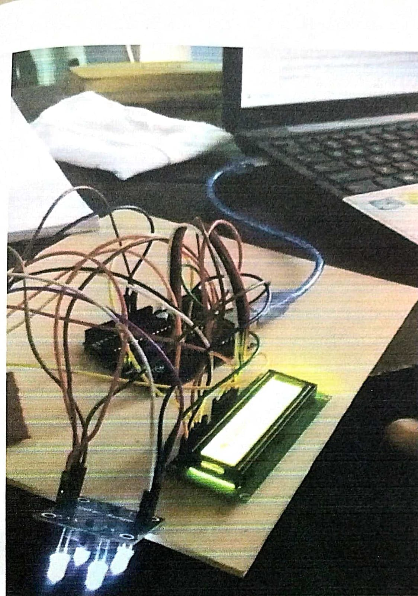

# Colour Sorting Machine

## Introduction
This mini project presents the design and implementation of a
Colour Sorting Machine developed as part of the B.Tech curriculum
in Electronics and Communication Engineering.

The system identifies the colour of an object using a colour sensor
and displays the detected colour on an LCD module.

---

## Objective
- To detect the colour of objects using a colour sensor
- To process sensor data using a microcontroller
- To display the detected colour on an LCD

---

## Hardware Components Used
- Arduino UNO
- TCS3200 Colour Sensor
- 16x2 LCD Display
- LEDs
- Connecting wires
- Power supply

---

## Working Principle
The colour sensor detects the reflected light from the object.
Based on the intensity values of red, green, and blue components,
the microcontroller determines the colour of the object.
The identified colour is then displayed on the LCD.

---

## Project Images

### Hardware Setup

### LCD Display Output

---

## Project Report
The complete project report is available in the `report` folder:

- **Colour_Sorting_Machine_Report.pdf**

---

## Project Type
B.Tech Mini Project  
Department of Electronics and Communication Engineering